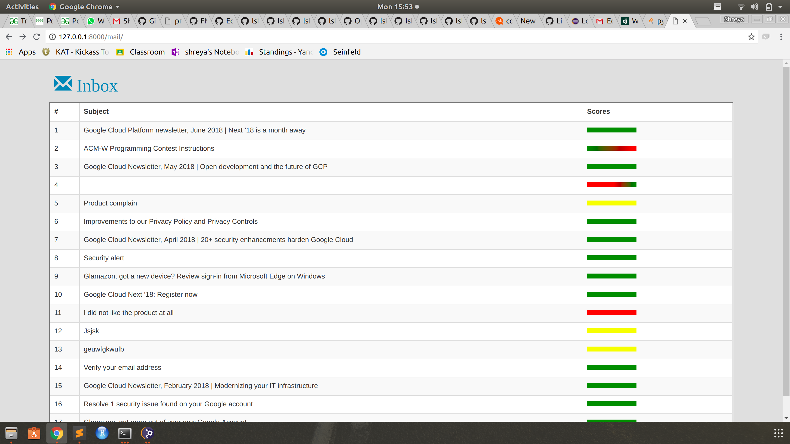
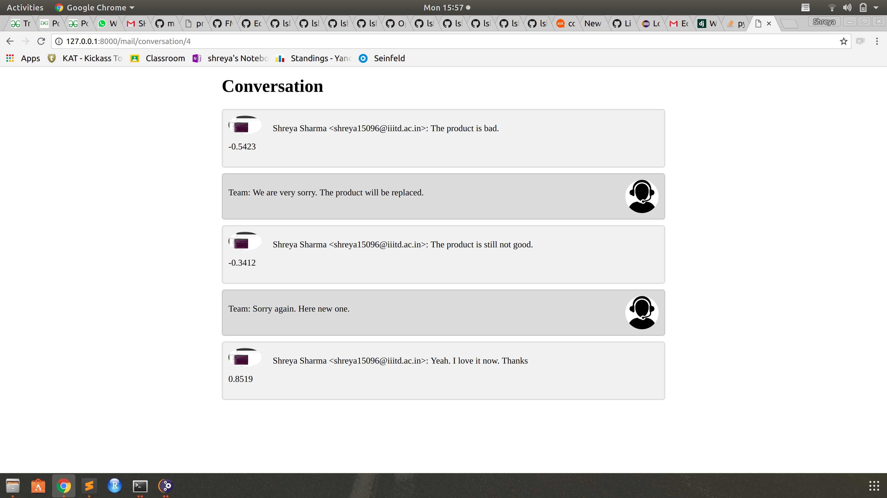

A Django based webapp that extracts Gmail threads of a Gmail Account using Gmail API and analyses the sentiments dipicted in the mailing threads using Vader Sentiment Analysis Tool. Note that, the Gmail API of the Gmail Account whose message threads are needed must be enabled.

For front end I used HTML-CSS, Bootstrap and javascript.

Sample: 
This is how the Inbox will look like. The rightmost column depicts the transition of sentiments: Red shows a negative sentiment, Green shows a positive sentiment and Yellow shows a neutral sentiment.

When a partcular email thread is selected, the page is redirected to another page that shows the mails sent back and forth between the client and admin. Along with each message the client has sent, a sentiment score is shown. 

This analysis of emails is helpful for organisations which want to improve relationships with their customers and also prioritize different mails in the inbox. 

